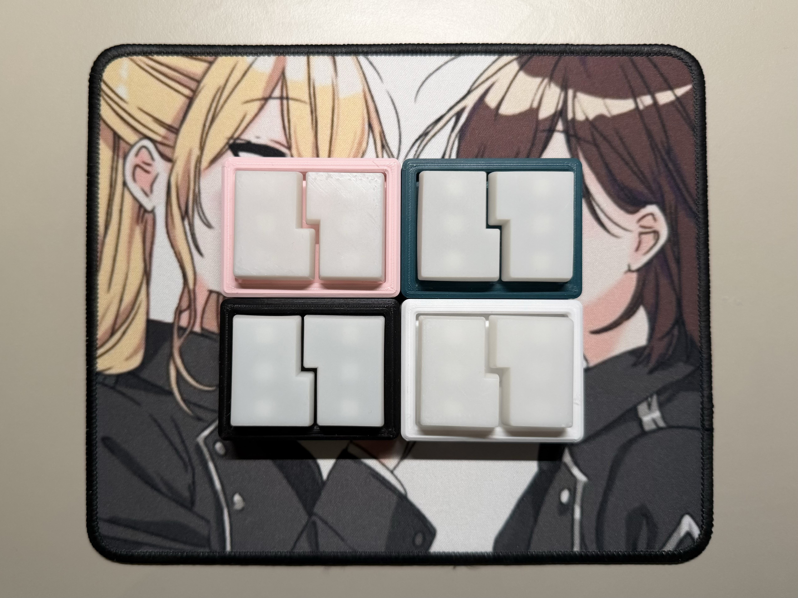
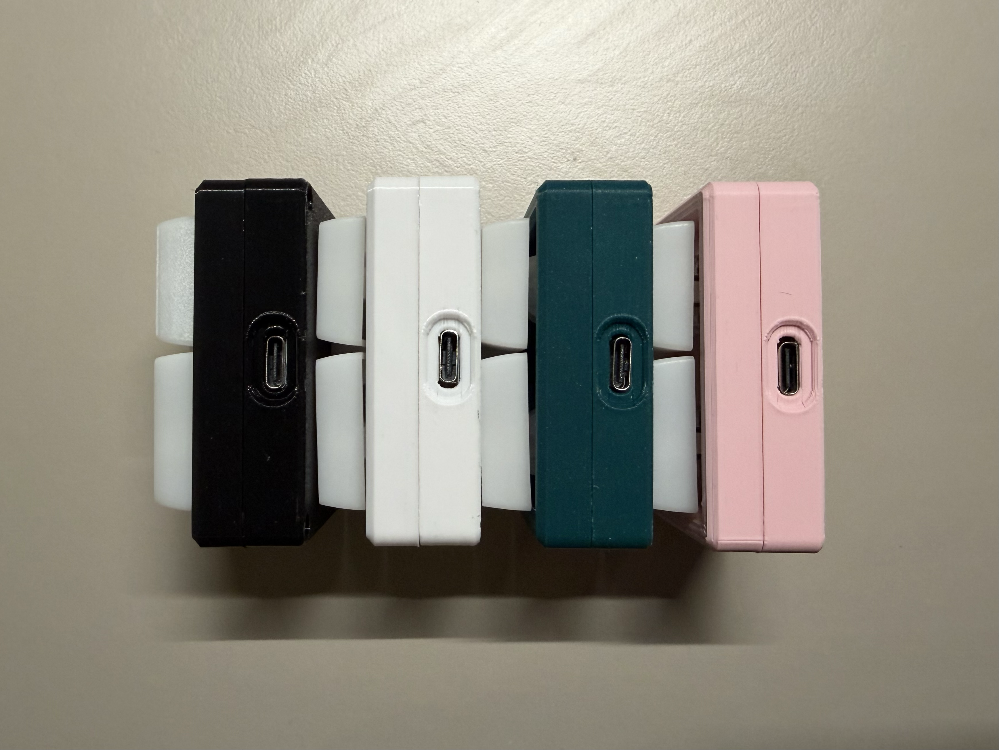
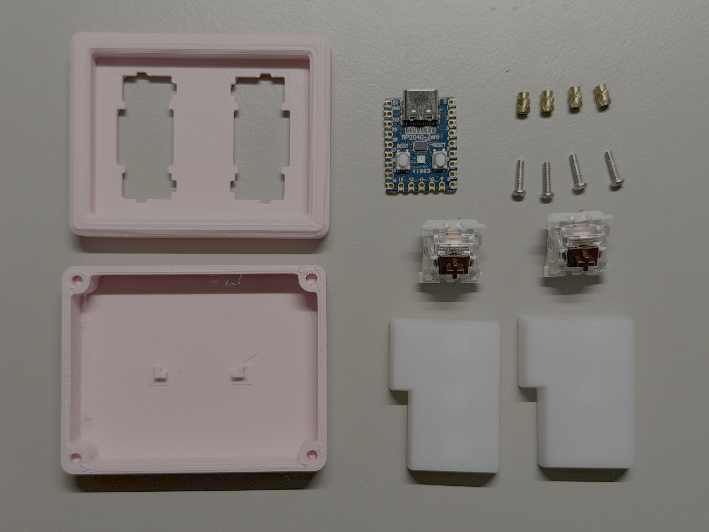
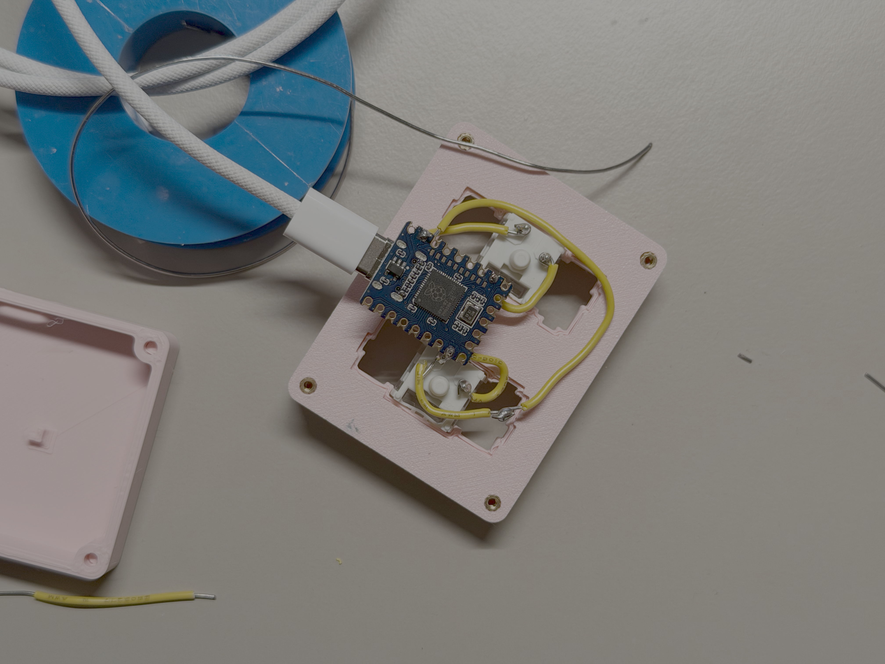
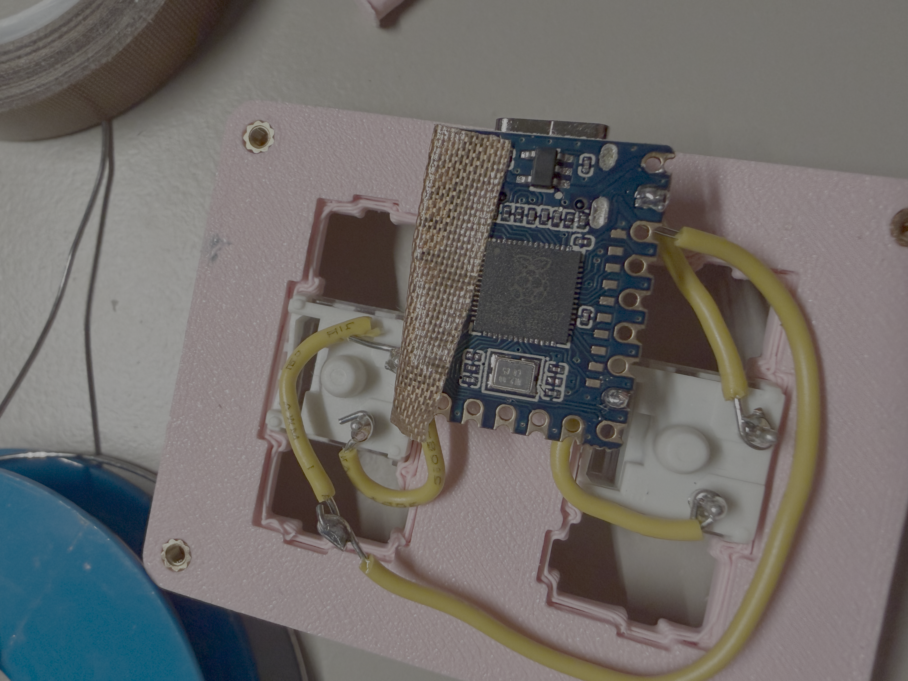

<h1> macropad with 2 ISO enter keys</h1>

"69" in name is only based on the keycap arrangement and does not actually have 69 keys (nor a 69%)

 

| | |
| --- | --- |
|  ||
|  |  |

 
 

table of contents
[toc]

## usage

- The macropad can be used with type-c cable that supports data. This includes usb A-C or usb C-C cables. 
 

- To configure your macropad, go to the websie [vial.rocks](https://vial.rocks/), or you can use the offline software which can be downloaded at https://get.vial.today/

 

## firmware

 - `.uf2` is available under `/firmware`
(tb updated)

 

## build guide

### Materials required 

|amount | item | 
|---| ---|
| 4 | heat set inserts M2 x 5mm |
| 4 | M2 x 4mm screws |
| 2 | MX switches of your choice |  
| 2 | ISO enter keycaps |  
| 1 | rp2040 zero |  
| 1 | top and bottom case |  
| some | wires (22 awg in photo) | 
| some | solder |

### Tools required

 - soldering iron 
 - wire strippers 
 - screwdriver corresponding to screws of choice 

 

### experimental methods

**step 1**

insert the heatset inserts into the top case by using a soldering iron. fit switches onto the plate integrated top case.

 

**step 2**

solder wires onto the switches

 

**step 3**

solder wires onto the rp2040 zero. connections are as follows: 

 - sw1: GP15---GND
 - sw2: GP7---GND

sw1 will be the switch that is on the left of the keypad when in use.

 

***step 4 (optional)***

tape wires or pins or rp2040 so there is no shorting in the circuits.

 

**step 5**

somehow make everything fit and secure the bottom case onto the top case with the four M2 screws.

|  | |
|--- | --- |
| step 1  | step 2  | 
| step 3  | step 4  |
|step 5 | step 5 (cont.)  |

## firmware

Flash firmware as per usual.

Bootloader magic is enabled on the provided vial firmware, just hold the left key when plugging in the pad, then you should be able to get into bootloader mode.

